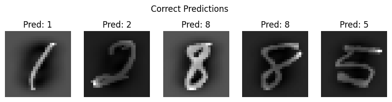
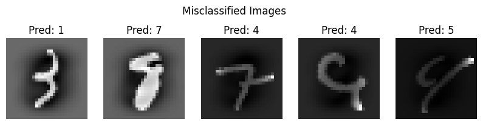

# Least Squares Classification on MNIST  

This project implements a Least Squares Classifier to recognize handwritten digits from the MNIST dataset.  

## 📌 Features  
- Uses `scikit-learn` to fetch and preprocess MNIST  
- Applies Least Squares Classification using `numpy.linalg.lstsq`  
- Evaluates accuracy on training and test sets  
- Visualizes correct and misclassified images  

## 🚀 Installation  
To run this project:  
1. Install dependencies:  
   ```bash
   pip install numpy scikit-learn matplotlib

## 🔍 Results  
- **Training Accuracy:** 85.9%  
- **Test Accuracy:** 85.4%

- Below are some correctly classified images:  
    
- Below are some misclassified images:  
    
